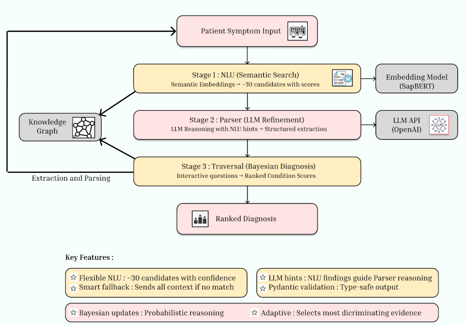
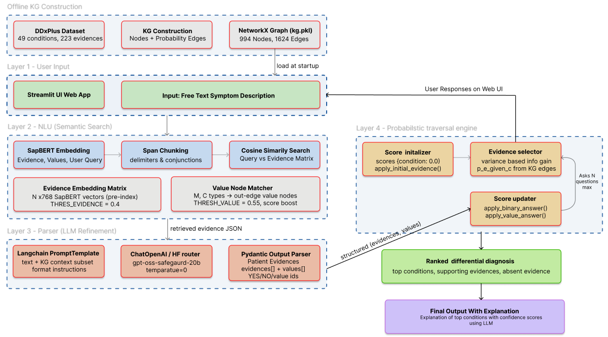

# Knowledge Graph-Based Differential Diagnosis (DDx) Engine

An interactive, AI-driven clinical reasoning engine that parses raw patient symptom narratives, aligns them to a medical knowledge graph, and conducts dynamic, information-theoretic follow-up questioning to output ranked differential diagnoses.

---

## 📽️ Project Demonstration

Placeholder for the DDx System walkthrough video:

[](https://www.youtube.com/watch?v=placeholder)

---

## ⚙️ Core Architecture & Data Flow

The diagnostic system integrates semantic search (NLU), LLM parsing, and probabilistic graph traversal to guide patient interactions.

### 1. Overall Simplified Architecture

The system processes symptom inputs through a three-stage pipeline to establish a probabilistic diagnosis:



- **Patient Symptom Input**: Natural language text supplied by the user.
- **Stage 1: NLU (Semantic Search)**:
  - Evaluated by the **SapBERT** embedding model to encode symptom phrases.
  - Maps natural language text chunks to pre-computed candidate symptom vectors in the Knowledge Graph, identifying the top ~30 matches with confidence scores.
- **Stage 2: Parser (LLM Refinement)**:
  - Employs an LLM API (**OpenAI**) to refine retrieved NLU hints and construct structured patient symptom records.
  - Outputs type-safe schemas utilizing Pydantic constraints.
- **Stage 3: Traversal (Bayesian Diagnosis)**:
  - Dynamic clinical engine updating diagnosis probabilities on the Knowledge Graph.
  - Asks interactive follow-up questions to query missing evidences, updating ranked condition scores continuously to output the final diagnosis.
- **Key Features**:
  - *Flexible NLU*: Captures wide symptom ranges by ranking top candidates.
  - *Smart Fallback*: Resolves missing matches by sending full narrative contexts directly to the LLM.
  - *LLM Hints*: Restricts parser search spaces using Retriever matching scores.
  - *Pydantic Validation*: Guarantees structure and type safety of LLM outputs.
  - *Bayesian Updates*: Incorporates graph edge probabilities into likelihood updates.
  - *Adaptive Gating*: Focuses inquiries on highly discriminating symptoms.

---

### 2. Detailed Project Pipeline Diagram

The comprehensive pipeline shows data initialization, execution flow, clinical traversal calculation, and Streamlit user interface interactions:



#### A. Data Construction & Startup Setup
- **DDXPlus Dataset**: Inputs raw clinical data sheets (conditions, symptoms, and structural parameters).
- **KG Construction**: Parses symptoms and mappings to build a NetworkX Graph saved at `Pickle/kg.pkl` containing 49 conditions and 223 symptom evidences (994 nodes and 1,624 directed probability edges representing clinical associations ($P(Evidence \mid Condition)$)).
- **Startup Loading**: Pre-loads the knowledge graph, pre-computed SapBERT symptom vectors, and local configuration templates into memory.

#### B. NLU Retrieval Pipeline
- **User Description**: Text describing symptoms is inputted via the Streamlit UI web app.
- **Span Chunking**: Raw descriptions are broken down into logical semantic units using transitions and delimiter punctuation (e.g. *,*, *;*, *but*, *also*).
- **Cosine Similarity Search**: Translates chunks into vectors and queries them against the pre-indexed `N x 768` SapBERT matrix.
  - Filters candidate symptoms using `THRESH_EVIDENCE = 0.40`.
  - Handles multi-choice and categorical symptom nodes (`M` and `C` data types) by resolving output-edge sub-values (boosted at `THRESH_VALUE = 0.55`).
- **Context Assembly**: Compiles matches into a structured retrieved evidence JSON string.

#### C. LLM Structured Parsing Pipeline
- **LangChain Prompt Template**: Combines the raw user query, matched retriever JSON context, and target schema instructions.
- **ChatOpenAI Client**: Sends the prompt to a serverless Hugging Face router using `gpt-oss-safeguard-20b` (at `temperature=0`).
- **Pydantic Output Parser**: Resolves raw LLM text into a structured Pydantic `PatientEvidences` object mapping symptom codes to values (`YES`, `NO`, or categorical sub-keys).

#### D. Traversal & Interactive Gating Pipeline
- **Score Initializer**: Seeds initial condition scores to `0.0`.
- **Apply Initial Evidence**: Updates the diagnostic state based on symptoms detected in the initial patient narrative story.
- **State Traversal Loop**: Iterates up to $N$ times to gather missing info:
  - **Evidence Selector**: Computes variance-based information gain to select the next most discriminating symptom code.
  - **User Gating Prompt**: Renders questions (`🩺 Question: ...`) to collect answers via the Streamlit UI.
  - **Score Updater**: Incorporates answers (using `apply_binary_answer` or `apply_value_answer`) to recalculate condition likelihood updates dynamically.
- **Output Convergence**: Ranks candidates based on final log-probabilities.
- **Final Output explanation**: Generates clinical rationale explanations detailing condition definitions and supporting/absent evidence details using an LLM.

---

## 🚀 Quick Start Guide

### 1. Prerequisites & Installation
Ensure you have Python 3.8+ installed.

1. Clone the repository and navigate to the project root:
   ```bash
   cd DDx-Using-Knowledge-Graph
   ```
2. Create and activate a virtual environment:
   ```bash
   python -m venv .venv
   # Windows:
   .venv\Scripts\activate
   # Linux/macOS:
   source .venv/bin/activate
   ```
3. Install the project dependencies:
   ```bash
   pip install -r requirements.txt
   ```

### 2. Dataset Setup
This project uses the **DDXPlus Dataset (English)**.
1. Download the dataset files by following the instructions in [Data/Readme.md](file:///c:/Users/91897/OneDrive/Desktop/FYP/DDx-Using-Knowledge-Graph/Data/Readme.md).
2. Extract the dataset files directly into `Data/ddxplus/`.

### 3. Construct the Knowledge Graph
Before launching the runtime engine, compile the medical knowledge graph:
1. Run the [KG_Construction](file:///c:/Users/91897/OneDrive/Desktop/FYP/DDx-Using-Knowledge-Graph/KG_Construction.ipynb) notebook.
2. This processes the clinical datasets and serializes the nodes and edges into `Pickle/kg.pkl`.

### 4. Run the DDx Interactive CLI
Launch the interactive diagnostic loop in your terminal:
```bash
python -m scripts.run_ddx
```

---

## 🩺 Step-by-Step Interactive Run Example

Here is a step-by-step walkthrough demonstrating how the engine processes a patient description of **Cluster Headache**:

### Step 1: Input Narrative Parsing
**Patient Input**:
> *"For the past couple of weeks, I’ve been having sudden episodes of very intense pain on one side of my head, mainly around my eye and temple. The pain feels sharp and unbearable. No fever and cough."*

**Engine Processing Trace**:
- **Chunks Split**: `['sudden episodes of very intense pain on one side of my head', 'mainly around my eye and temple', 'pain feels sharp and unbearable', 'no fever', 'cough']`
- **NLU Matches**:
  - `E_121` (headache) mapped to `YES`.
  - `E_204` (restlessness) mapped to `YES`.
  - `E_201` (fever) mapped to `NO`.
  - `E_93` (cough) mapped to `NO`.

### Step 2: Interactive Dynamic Questioning
Based on initial symptoms, the traversal engine updates condition probabilities and selects the next most informative question:

```txt
🩺 Question: Do you have watering eyes on the same side as the headache?
Your answer: yes

[Parser] Querying model 'openai/gpt-oss-safeguard-20b' (Attempt 1/3)...
Matched: E_123 (watering eyes) -> YES
```

### Step 3: Diagnostic Output
The engine converges on the final condition ranks after completing follow-up queries:

```txt
=== FINAL RANKED CONDITIONS ===
Cluster headache                         prob=0.9234
Migraine                                 prob=0.0621
Tension headache                         prob=0.0145
```

---

## 🧪 Testing Suite
Execute the programmatic unit testing suite and generate detailed markdown test reports:
```bash
python -m scripts.run_unit_tests
```
The execution statistics and individual status logs will be generated at [test_report.md](file:///c:/Users/91897/OneDrive/Desktop/FYP/DDx-Using-Knowledge-Graph/results/test_report.md).

---

## 📚 Technical Documentation Map

For deep dives into project algorithms, mathematical update rules, and package interfaces, explore the design docs:

| Component | Design Document | Description |
| --- | --- | --- |
| **Interfaces** | [interfaces.md](file:///c:/Users/91897/OneDrive/Desktop/FYP/DDx-Using-Knowledge-Graph/designdoc/core/interfaces.md) | Abstract interfaces enforcing DIP and ISP principles. |
| **NLU Engine** | [nlu.md](file:///c:/Users/91897/OneDrive/Desktop/FYP/DDx-Using-Knowledge-Graph/designdoc/core/nlu.md) | Embedding matching (SapBERT) and chunking rules. |
| **LLM Parser** | [parser.md](file:///c:/Users/91897/OneDrive/Desktop/FYP/DDx-Using-Knowledge-Graph/designdoc/core/parser.md) | Pydantic validation schema, retry loops, and fallbacks. |
| **Logging** | [logger.md](file:///c:/Users/91897/OneDrive/Desktop/FYP/DDx-Using-Knowledge-Graph/designdoc/core/logger.md) | Centralized child loggers and config levels. |
| **Traversal** | [traversal.md](file:///c:/Users/91897/OneDrive/Desktop/FYP/DDx-Using-Knowledge-Graph/designdoc/core/traversal.md) | Mathematical update formulas and entropy metrics. |
| **Testing** | [tests.md](file:///c:/Users/91897/OneDrive/Desktop/FYP/DDx-Using-Knowledge-Graph/designdoc/core/tests.md) | Unit testing package structure and mocking setup. |
| **Execution CLI** | [run_ddx.md](file:///c:/Users/91897/OneDrive/Desktop/FYP/DDx-Using-Knowledge-Graph/designdoc/scripts/run_ddx.md) | CLI orchestration and interactive diagnostic session runner. |
