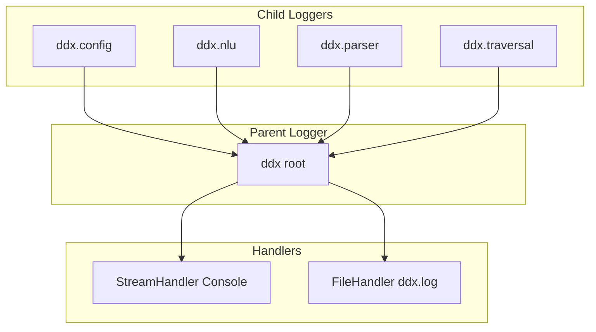

# Design Document: Centralized Structured Logging System

The file [logger.py](../../core/logger.py) implements the centralized structured logging manager for the DDx Knowledge Graph system. It replaces raw standard stdout `print()` statements with Python's standard `logging` library, organizing system events into dynamic severity levels.

---

## 1. Log Architecture

The logging system is structured hierarchically. The root logger `ddx` handles formatting and handler distribution, and sub-modules instantiate child loggers that automatically propagate events up to `ddx`.

---

## 2. Dynamic Configurations

Logging configurations are defined inside `core/config.json` under the `logging` block:
- **`level`**: String indicating default minimum severity level (e.g. `"INFO"`, `"DEBUG"`, `"WARNING"`, `"ERROR"`).
- **`log_to_file`**: Boolean setting whether to log events to a physical file.
- **`file_path`**: Destination filepath if file logging is enabled (defaults to `"results/ddx.log"`).

---

## 3. Log Levels by Component

### A. Config Management (`ddx.config`)
- **`WARNING`**: Logs failures when parsing config files, notifying the system of defaults fallbacks.

### B. NLU Retriever (`ddx.nlu`)
- **`WARNING`**: Logs if pre-computed embeddings are missing on startup.
- **`INFO`**: Logs raw queries and chunk segment processing lists.
- **`DEBUG`**: Logs cosine similarity scores and evidence matching evaluations for each candidate candidate node.

### C. LLM Parser (`ddx.parser`)
- **`INFO`**: Logs LLM connection attempts and candidate model queries.
- **`WARNING`**: Logs individual attempt retry details and model fallbacks.
- **`DEBUG`**: Logs raw output strings returned by the LLM and the structured parsed Pydantic object dicts.
- **`ERROR`**: Logs critical failures when all candidate models and retries are completely exhausted.

### D. Traversal Engine (`ddx.traversal`)
- **`INFO`**: Logs parsed initial evidences, step-by-step diagnostic differentials, and final condition rankings.
- **Stdout print/input**: Direct interactive patient questions (`🩺 Question: ...`) bypass the logging metadata formatting by outputting directly to stdout, maintaining clean user-facing terminal interactions.
